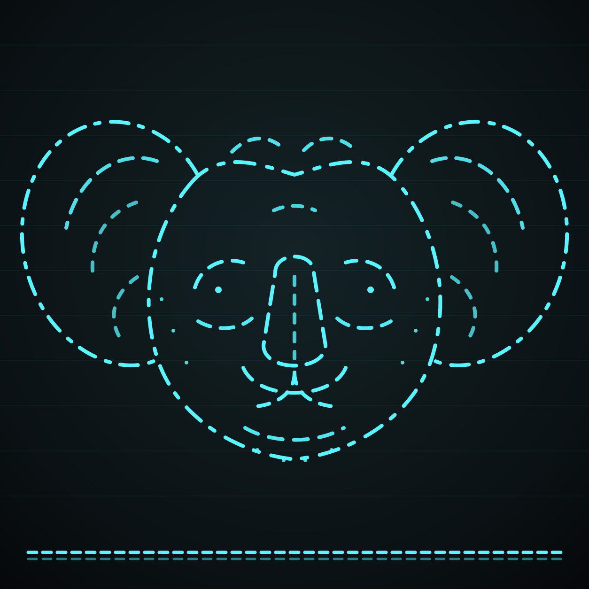

<p align="center">
  
</p>

# KoalaByte Blue V2 Heltec Edition

**KoalaByte Blue is a pocket-sized koala cyberdeck with attitude.** It uses a Raspberry Pi 3B+ as the main Linux brain, a Waveshare ESP32-S3 DualEye board for animated eyes, face feedback, touch, voice-front-end work, and a secondary Wi-Fi/BLE node, plus a Heltec Mesh Node T114 with onboard nRF52840 for primary BLE, GNSS, LoRa, and Meshtastic App duties.

KoalaByte Blue is for lawful owned-device labs, defensive review, education, and your own hardware. Do not use it on systems, vehicles, radios, networks, or devices you do not own or do not have permission to test.

---

## Quick build profile

| Part | Role |
|---|---|
| Raspberry Pi 3B+ | Main Linux brain, installer, menus, logs, reports, local services, voice routing, main Wi-Fi controller, GreatWhite Reef PCAP review, and readiness checks. |
| Waveshare ESP32-S3 DualEye 1.28in board | Animated eyes, touch bridge, mic/voice bridge path, secondary Wi-Fi survey node, BLE support node, and visual personality. |
| Heltec Mesh Node T114 / nRF52840 | Primary BLE node plus GNSS and LoRa/Meshtastic path. It is not a Wi-Fi node. |
| 8 independent key button module | Replaces the old six loose 4-pin tactile buttons. K1-K6 are menu controls, K7 Power On/Off requests shutdown, and K8 Reset / Reboot requests reboot. |
| USB power bank / regulated USB supply | Production power source. No loose 18650/raw battery wiring is required. |
| InnoMaker USB-to-CAN kit | Optional isolated owned-bench CAN adapter. InnoMaker CAN kit is optional and skipped if absent. |

No custom PCB is required for this profile.

---

## Current radio roles

```text
Heltec T114 / nRF52840 -> primary BLE node, GNSS node, and LoRa/Meshtastic node; no Wi-Fi
Raspberry Pi 3B+       -> main Wi-Fi controller, BLE support/fallback node, and PCAP review host
ESP32-S3 DualEye       -> secondary Wi-Fi survey node, BLE support node, touch bridge, and face/eye UI
```

Koala Kombat Kruisin uses the Pi as the main Wi-Fi controller, the ESP32-S3 DualEye as the extra Wi-Fi survey node, and the Heltec T114/nRF52840 as the primary BLE/GNSS/LoRa path.

---

## What the current `Main` branch includes

| Feature | What it does |
|---|---|
| One-shot installer | Runs the Pi, ESP32-S3, Heltec T114, menu, service, and readiness setup from one command. |
| `--check-only` dry run | Validates the repo without flashing firmware or installing services. |
| `--heltec-uf2-first` install mode | Requires the Heltec `HT-n5262` UF2 bootloader volume before flashing the T114, then runs the full one-shot. |
| Wrapped jungle UI boot | Starts in the full jungle/eucalyptus graphical interface by default, not terminal mode. |
| 8-key front panel | Supports K1-K8 GPIO input, including K7 Power On/Off and K8 Reset / Reboot. |
| KoalaByte Doctor | Runs quick/full diagnostics and writes `logs/doctor/koalabyte_doctor_status.json`. |
| Stable udev names | Adds `/dev/koalabyte-*` aliases for easier board discovery. |
| Heltec T114 HT-n5262 flash support | Supports the manual double-RST UF2 bootloader volume named `HT-n5262`. |
| ESP32-S3 DualEye touch | Includes a Waveshare CST816x I2C touch backend and Pi touch menu bridge. |
| Cleaned jungle menu | Keeps branded tools, wrapped BlueZ tools, GreatWhite Reef, pop-up keyboard input, and the Lab submenu. |
| GreatWhite Reef | Adds TigerShark (`tshark`) and Great Wire Shark (`wireshark`) PCAP/PCAPNG review. |
| GreatWhite selectable PCAPs | Syncs `.pcap`/`.pcapng` files into `logs/greatwhite_reef/pcaps/`, then exposes selectable `PCAP N: filename` menu rows. |
| Pop-up text input | Opens only from actual text-input rows for WiGLE name/key, protected local lock/unlock, BlueZ lab target, and Meshtastic message/destination text. |
| KillerKoala companion | Uses fast local phrase responses by default with optional TinyLlama/Ollama banter. |

Fast repo check:

```bash
bash scripts/install_koalabyte_one_shot.sh --check-only
```

Fast deployability check:

```bash
bash scripts/check_deployability.sh
```

Fast health check:

```bash
bash scripts/koalabyte_doctor.sh --quick
```

---

## Hardware needed

### Required

```text
Raspberry Pi 3B+
128 GB microSD card recommended, 32 GB minimum for basic testing
Regulated USB power bank or USB power supply
Waveshare ESP32-S3 DualEye 1.28in board
Heltec Mesh Node T114
USB data cable for ESP32-S3 DualEye
USB-C data cable for Heltec T114
8 independent key button module with VCC, GND, and K1-K8 header
40-pin GPIO extender/cable or direct GPIO wiring
Correct antennas for the boards you use
```

### Optional

```text
InnoMaker USB-to-CAN kit
USB data cable for InnoMaker CAN kit
External case-mounted antenna pigtails
8 ohm speaker path for the ESP32-S3 if your board supports it
Small fan for the Raspberry Pi case
Powered USB hub if USB devices disconnect or the Pi shows undervoltage
USB or Bluetooth keyboard for faster text entry
```

### Software tools installed by the Pi helper

```text
TigerShark -> tshark
Great Wire Shark -> wireshark
PlatformIO -> pio, for ESP32-S3 firmware flashing
nRF/Zephyr tools -> west, when Heltec T114 build/flash is enabled
```

Power rule: use a regulated USB power bank or USB supply. Do not feed raw battery voltage into the Pi, ESP32-S3, Heltec T114, button wiring, CAN wiring, or antenna hardware.

---

## 8-key front-panel button board

KoalaByte Blue now uses the GODIYMODULES MOD-ST034-1 / ASIN B0FH9C88DJ **8 independent key button module** instead of the old six separate 4-pin tactile buttons. The Amazon listing is a two-pack; only one board is required for this build.

Treat the module header as:

```text
VCC  GND  K1  K2  K3  K4  K5  K6  K7  K8
```

Use Pi **3.3V only** for VCC when the K outputs connect to Raspberry Pi GPIO.

```text
Module VCC -> Pi 3.3V, physical pin 1 or 17
Module GND -> Pi GND, physical pin 39 or any Pi GND
Module K1-K8 -> assigned Raspberry Pi BCM GPIO inputs
```

The board outputs LOW when a key is pressed and HIGH when released. KoalaByte also enables software pull-up behavior in `gpiozero` so the repo remains stable with the active-low button logic.

| Module key | Front-panel label | Action | BCM GPIO | Physical pin |
|---|---|---|---:|---:|
| K1 | Main Menu | `main_menu` | GPIO5 | Pin 29 |
| K2 | Left / Back | `move_left` / `back` | GPIO6 | Pin 31 |
| K3 | Enter / Select | `select` | GPIO13 | Pin 33 |
| K4 | Right / Forward | `move_right` / `forward` | GPIO19 | Pin 35 |
| K5 | Up | `up` | GPIO26 | Pin 37 |
| K6 | Down | `down` | GPIO21 | Pin 40 |
| K7 | K7 Power On/Off | `power_toggle` -> safe software shutdown | GPIO20 | Pin 38 |
| K8 | K8 Reset / Reboot | `reset` -> safe software reboot | GPIO16 | Pin 36 |

Important: K7 can request a clean software shutdown while the Pi is already running. A GPIO key cannot power on a fully unpowered Raspberry Pi by itself; true front-panel power-on still needs the USB power bank button or a supported external power-control/wake board.

Button test commands:

```bash
PYTHONPATH=pi-companion python3 scripts/setup_gpio_buttons.py --check-only
PYTHONPATH=pi-companion python3 scripts/setup_gpio_buttons.py --live-test --seconds 20
python3 scripts/test_gpio_buttons.py
```

---

## Fresh Raspberry Pi 3B+ install: Pi OS Lite, no desktop

This is the clean install path for a brand-new microSD card. **Do not flash KoalaByte directly to the SD card.** First flash Raspberry Pi OS Lite, boot the Pi, then run the KoalaByte installer.

### 1. Flash Raspberry Pi OS Lite to the microSD

Use Raspberry Pi Imager on your computer:

```text
Raspberry Pi Device: Raspberry Pi 3
Operating System: Raspberry Pi OS Lite, 64-bit recommended
Storage: your microSD card
```

Open Imager settings before writing the card:

```text
Set hostname: koalabyte-blue
Enable SSH: yes
Set username/password: your choice
Configure Wi-Fi: only if you are not using Ethernet
Set locale/timezone: your region
```

Write the card, eject it safely, insert it into the Raspberry Pi 3B+, connect Ethernet or Wi-Fi, then power the Pi from a regulated USB power supply or power bank.

### 2. SSH into the Pi

```bash
ssh <your-user>@koalabyte-blue.local
```

If `.local` does not resolve, find the Pi IP address from your router and use:

```bash
ssh <your-user>@<pi-ip-address>
```

### 3. Update the Pi first

```bash
sudo apt update
sudo apt full-upgrade -y
sudo reboot
```

Reconnect after reboot:

```bash
ssh <your-user>@koalabyte-blue.local
```

### 4. Plug in the KoalaByte boards

Use data-capable USB cables:

```text
ESP32-S3 DualEye -> Raspberry Pi USB port
Heltec Mesh Node T114 -> Raspberry Pi USB port with USB-C data cable
Optional InnoMaker CAN kit -> Raspberry Pi USB port only if using CAN bench tools
```

The InnoMaker CAN kit can stay unplugged for a normal install. The installer skips CAN setup when the adapter is absent.

### 5. Put the Heltec T114 into UF2 mode first

This is the recommended full one-shot flashing path.

```text
1. Connect the Heltec T114 to the Pi with a USB-C data cable.
2. Press the T114 RST key twice quickly.
3. Wait for the mounted UF2 bootloader volume named HT-n5262.
```

Confirm the Pi sees the volume:

```bash
lsblk
```

Look for:

```text
HT-n5262
```

The `--heltec-uf2-first` installer mode requires this `HT-n5262` volume. It forces the T114 `combined-safe` firmware through the UF2 copy path and disables accidental serial/west fallback for the Heltec flash step.

### 6. Download and run the installer from `Main`

First run the dry-run check:

```bash
curl -fsSL -o koalabyte-install.sh https://raw.githubusercontent.com/greatwhitek9-lab/KoalaByte-Blue/Main/install.sh
bash koalabyte-install.sh check-only
```

If the dry run passes and `HT-n5262` is visible, run the UF2-first full installer:

```bash
bash koalabyte-install.sh --heltec-uf2-first
```

The installer clones/updates the repo at:

```text
~/KoalaByte-Blue
```

Then it runs the one-shot installer. The Heltec flash step waits for the `HT-n5262` UF2 volume and copies the generated `zephyr.uf2` firmware to it.

If you want to install everything except Heltec flashing while testing USB cables, use:

```bash
FLASH_T114_ON_PLUG=0 bash koalabyte-install.sh
```

### 7. Reboot and start KoalaByte Blue

```bash
sudo reboot
```

After reboot, the systemd service should start the wrapped KoalaByte Blue jungle UI automatically. Manual debug launch is still available:

```bash
cd ~/KoalaByte-Blue
bash scripts/koalabyte_blue_boot.sh
```

---

## Already cloned install

From inside an existing checkout:

```bash
bash install.sh check-only
bash install.sh --heltec-uf2-first
```

Or run the one-shot directly:

```bash
bash scripts/install_koalabyte_one_shot.sh --check-only
bash scripts/install_koalabyte_one_shot.sh --heltec-uf2-first
```

Useful install options:

```bash
# Explicit normal Heltec profile
T114_PLUG_FLASH_PROFILE=combined-safe bash scripts/install_koalabyte_one_shot.sh

# Recommended full one-shot T114 flash path; double-tap RST so HT-n5262 appears first
bash scripts/install_koalabyte_one_shot.sh --heltec-uf2-first

# Same UF2-first path through the top-level bootstrapper
bash install.sh --heltec-uf2-first

# Manual T114 UF2 copy path only, after HT-n5262 appears
T114_FLASH_METHOD=uf2 bash scripts/flash_t114_combined_safe.sh

# Skip Heltec flashing while debugging USB/ports
FLASH_T114_ON_PLUG=0 bash scripts/install_koalabyte_one_shot.sh

# Do not fail the whole install if the T114 is not ready yet
STRICT_T114_PLUG_FLASH=0 bash scripts/install_koalabyte_one_shot.sh

# Make system command dependency checks strict on a real Pi image
STRICT_FULL_RUNTIME_DEPENDENCIES=1 bash scripts/install_koalabyte_one_shot.sh

# Extra folders to sync into GreatWhite Reef PCAP review
KOALABYTE_REEF_PCAP_IMPORT_DIRS="/home/pi/captures:/mnt/usb/pcaps" bash scripts/install_koalabyte_one_shot.sh --check-only

# Stable serial aliases: auto/default, force, or skip
INSTALL_UDEV_RULES=auto bash scripts/install_koalabyte_one_shot.sh
INSTALL_UDEV_RULES=1 bash scripts/install_koalabyte_one_shot.sh
INSTALL_UDEV_RULES=0 bash scripts/install_koalabyte_one_shot.sh

# Boot services: auto/default, force, or skip
INSTALL_BOOT_SERVICES=auto bash scripts/install_koalabyte_one_shot.sh
INSTALL_BOOT_SERVICES=1 bash scripts/install_koalabyte_one_shot.sh
INSTALL_BOOT_SERVICES=0 bash scripts/install_koalabyte_one_shot.sh

# Optional CAN behavior
INSTALL_INNOMAKER_CAN=optional bash scripts/install_koalabyte_one_shot.sh
INSTALL_INNOMAKER_CAN=0 bash scripts/install_koalabyte_one_shot.sh
STRICT_INNOMAKER_CAN=1 bash scripts/install_koalabyte_one_shot.sh
```

---

## What the one-shot installer does

The normal one-shot path prepares the Pi companion, checks the repo, handles udev names, flashes the ESP32-S3 DualEye firmware, prepares/flashes the Heltec T114 combined-safe profile, validates KillerKoala AI/voice readiness, checks eyes and mouth sync, checks menu display sync, checks jungle/eucalyptus theme fit, validates menu-managed prompt UI controls, validates GreatWhite Reef module/docs/runtime dependencies, runs field readiness, checks version handshake, checks the local dashboard JSON, validates release/log helpers, runs KoalaByte Doctor, installs boot services, checks antenna readiness, prepares AntEater passive readiness, validates the K1-K8 front-panel button map, and records optional CAN status.

The `--heltec-uf2-first` path is the same full one-shot install, except the Heltec flash step requires the `HT-n5262` UF2 bootloader volume and uses the UF2 copy method instead of falling back to serial/west flashing.

The dry run does the readiness checks without flashing firmware or installing services:

```bash
bash scripts/install_koalabyte_one_shot.sh --check-only
```

Important output files:

```text
logs/one_shot_install_status.json
logs/one_shot/control_surface_status.json
logs/one_shot/full_runtime_dependencies.json
logs/one_shot/menu_prompt_ui_readiness.json
logs/one_shot/koala_kry_menu_readiness.json
logs/one_shot/field_readiness_status.json
logs/greatwhite_reef/greatwhite_reef_status.json
logs/greatwhite_reef/pcaps/
logs/t114_plug_flash_status.json
logs/t114_combined_safe_flash_status.json
logs/menu_actions/menu_action_manifest.json
logs/menu_actions/menu_theme_fit_status.json
logs/menu_sync/current_menu_state.json
logs/doctor/koalabyte_doctor_status.json
logs/version/koalabyte_version_handshake.json
logs/killerkoala/killerkoala_ai_readiness.json
logs/can/innomaker_optional_status.json
logs/gpio_buttons/gpio_button_manifest.json
```

---

## Button, touchscreen, keyboard, and voice control

```text
K1 -> Main Menu -> GPIO5
K2 -> Move Left / Back -> GPIO6
K3 -> Enter / Select -> GPIO13
K4 -> Move Right / Forward -> GPIO19
K5 -> Up -> GPIO26
K6 -> Down -> GPIO21
K7 -> Power On/Off -> GPIO20 -> safe shutdown request
K8 -> Reset / Reboot -> GPIO16 -> safe reboot request
```

Every enabled leaf action can be started from the same menu path:

```text
scroll / highlight -> select with K3, Enter, touchscreen long press, USB/Bluetooth keyboard, or KillerKoala voice command
```

Submenu rows open another menu. Tool rows inside that submenu run the actual action. Pop-up keyboard mode only appears after selecting text input rows such as `Type WiGLE Name`, `Type WiGLE Key`, `Create Location Password`, `Unlock Current Process`, `Type BlueZ Lab Target`, `Type Mesh Message`, or `Type Mesh Destination`.

Text entry controls:

```text
Buttons/touchscreen -> select on-screen keys
USB/Bluetooth keyboard -> type directly, Enter saves, Backspace deletes, Esc cancels
Voice-to-text -> say or route "keyboard text <words>" after the input page is open
```

The ESP32-S3 DualEye touch firmware uses the Waveshare CST816x I2C backend by default and emits `menu_touch` JSON events to the Pi bridge.

Common voice patterns:

```text
killerkoala open Eucalyptus
killerkoala open Koala Kombat Kruisin
killerkoala open Meshtastic App
killerkoala open GreatWhite Reef
killerkoala run PCAP 1
killerkoala run PCAP 2
killerkoala run TigerShark Read Latest PCAP
killerkoala run Wi-Fi + BLE Survey
killerkoala run T114 BLE Check
killerkoala open Koala Kan Kommander
killerkoala run Platypus BT-Proxy
killerkoala run Type Mesh Message
killerkoala status
killerkoala level
killerkoala buttons
```

---

## Antenna routing

```text
Heltec T114 LoRa connector -> region-matched LoRa antenna
Heltec T114 2.4 GHz connector -> 2.4 GHz antenna if your T114 board exposes one
ESP32-S3 DualEye 2.4 GHz connector -> ESP32-S3 Wi-Fi/BLE antenna if your board exposes one
Raspberry Pi 3B+ -> built-in Wi-Fi antenna; optional USB Wi-Fi adapter only
```

Do not swap LoRa and 2.4 GHz antennas. They are different radio paths.

---

## Jungle menu overview

The visible UI uses one shared jungle-adventure/eucalyptus theme for terminal and touchscreen modes. The renderer uses a shared font stack, carved title text, leaf borders, and automatic text fitting/wrapping so menu labels and selected-item descriptions stay inside their dialogue borders.

### Main Canopy

| Main item | What it opens |
|---|---|
| Eucalyptus | Passive BLE logger controls, GPS trail builder, WiGLE text input/status/upload, and Koalagotchi mode. |
| Koala Kombat Kruisin | Passive Wi-Fi/BLE/GPS survey mapping, WiGLE text input, and WiGLE upload tools. |
| Bluetooth Tools | Custom BLE tools plus wrapped BlueZ tools with custom KoalaByte names. |
| Didgeridoo | Heltec T114/nRF52840 BLE, GNSS, LoRa/Meshtastic, Meshtastic App, protected lock input, and location helpers. |
| CAN Bench Tools | Optional InnoMaker USB-to-CAN bench workflow. |
| GreatWhite Reef | TigerShark and Great Wire Shark PCAP/PCAPNG review, selectable PCAP rows, and packet-analysis reporting. |
| Reports & Reviews | Documentation, review, inventory, and lab report builders. |
| System / Companion | KillerKoala voice, XP/status, buttons, settings, and helper controls. |
| Lab | Protected lab-focused BlueZ shortcuts, saved target scope, and location gate status. |
| Power & Exit | K7 Power On/Off shutdown, K8 Reset / Reboot, and quit controls. |

Protected Bluetooth actions use the menu-managed BlueZ lab scope state. You no longer need to manually export `KOALABYTE_BLUEZ_LAB_TARGET` or `KOALABYTE_BLUEZ_OWNED_DEVICE` for normal menu use. Use `Type BlueZ Lab Target` and `Owned Device Scope ON` from the Lab submenu instead.

### GreatWhite Reef

GreatWhite Reef is the wrapped packet-analysis submenu. It uses these KoalaByte names:

```text
TigerShark -> tshark
Great Wire Shark -> wireshark
```

GreatWhite Reef keeps PCAPs in:

```text
logs/greatwhite_reef/pcaps/
```

It automatically syncs `.pcap` and `.pcapng` files found under `logs/` into that folder. Extra folders can be added with `KOALABYTE_REEF_PCAP_IMPORT_DIRS`.

---

## KillerKoala AI companion

KillerKoala is the device personality. It uses a fast phrase-first system by default and can use a local TinyLlama/Ollama fallback for more flexible banter.

Default local AI settings:

```text
INSTALL_KILLERKOALA_OLLAMA=auto
STRICT_KILLERKOALA_OLLAMA=0
KILLERKOALA_BASE_MODEL=tinyllama:1.1b
KILLERKOALA_LLM_MODEL=killerkoala-tinyllama:latest
```

AI helper:

```bash
bash scripts/setup_killerkoala_ollama.sh
```
