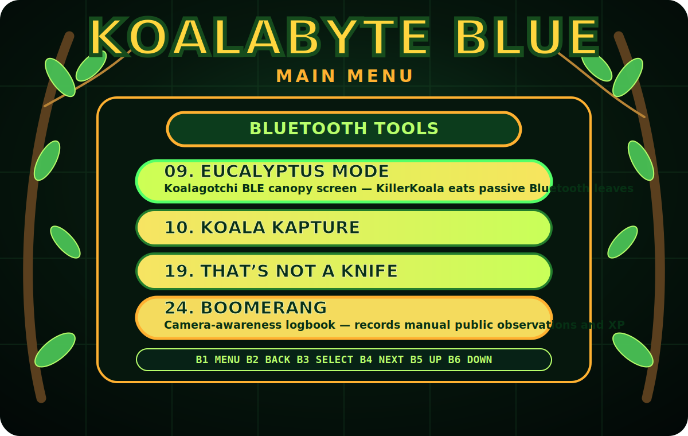
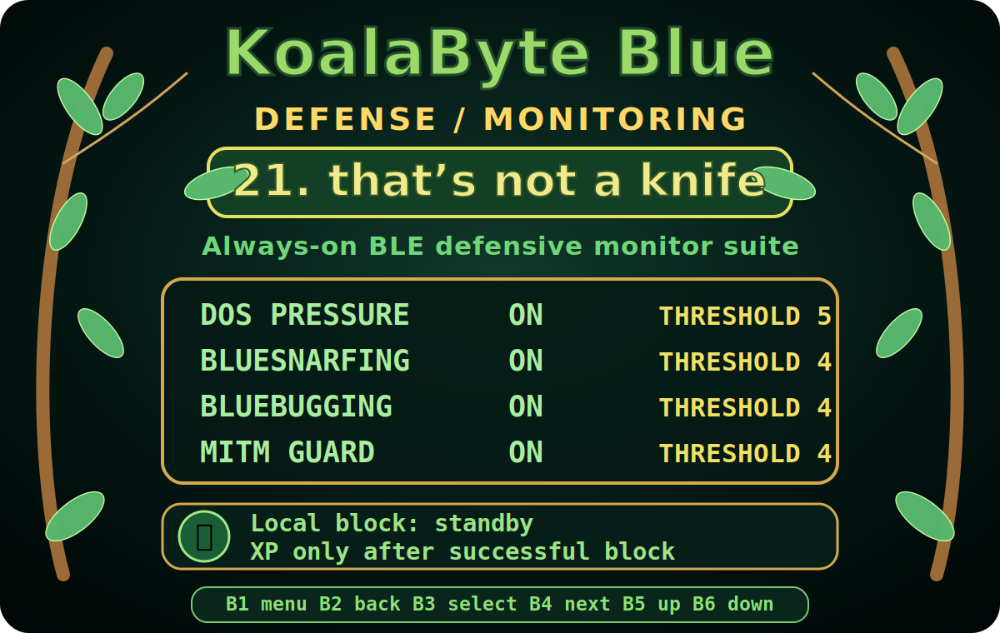

# KoalaByte Blue / killerkoala AI Companion Firmware RevA25

<p align="center">
  <strong>Your Bluetooth sidekick in the wild.</strong><br>
  A Raspberry Pi 3B+ + ESP32-S3 DualEye + Nordic nRF52840 Dongle build for safe Bluetooth research, passive logging, menu-driven lab workflows, defensive monitoring, and optional isolated CAN bench work.
</p>

<p align="center">
  
</p>

> **Use it right:** KoalaByte Blue is for lawful education, owned-device research, defensive testing, and authorized Bluetooth/CAN assessment only. Keep scans, captures, reviews, and bench tests inside your own lab, your own devices, or written scope.

---

## What is KoalaByte Blue?

KoalaByte Blue is a dongle-only, no-custom-PCB Bluetooth companion build with a jungle/eucalyptus menu, a little attitude, and a practical lab workflow. It brings together:

- A **Raspberry Pi 3B+** as the Linux companion host.
- An **ESP32-S3 DualEye display** for the boot splash, menu, and front-panel experience.
- A **Nordic nRF52840 Dongle** for KoalaByte Lab Mode or Koala Konnect Mode.
- The **killerkoala** companion for status, voice-style reactions, XP, and lab personality.
- The **that’s not a knife** always-on BLE defensive monitor suite.
- Optional **Koala Kan Kommander** support with the **InnoMaker USB to CAN Converter kit** for isolated bench-simulator or owned-harness CAN work.

In plain English: it is a pocketable Bluetooth lab buddy that can help you inventory devices, monitor local BLE activity, collect notes, create reports, switch dongle modes, and keep your Bluetooth workflows wrapped in a fun KoalaByte interface instead of a pile of raw commands.

---

## What can it do?

### Bluetooth and BLE lab workflows

- Run safe local BLE inventory scans.
- Start, stop, restart, and check the **eucalyptus** passive BLE logger.
- Capture and archive BLE advertisement metadata for review.
- Summarize observed devices and build authorized inventories.
- Use BlueZ helper wrappers with KoalaByte-themed names.
- Generate safe packet-capture notes and owned-device review checklists.
- Switch the nRF52840 Dongle between **KoalaByte Lab Mode** and **Koala Konnect Mode**.

### Defensive monitor suite: “that’s not a knife”

<p align="center">
  
</p>

The **that’s not a knife** action is an always-on local defensive monitor suite. It watches for local signs of BLE pressure or suspicious access patterns and then blocks KoalaByte Blue’s own local BLE workflows when a defensive condition trips.

Current individual monitors:

| Monitor | Default | Purpose |
|---|---:|---|
| `dos_pressure` | On | Repeated connection/controller pressure patterns. |
| `bluesnarfing` | On | Suspicious local OBEX/PBAP/contact-card/file-pull style access patterns. |
| `bluebugging` | On | Suspicious local RFCOMM, AT-command, handsfree, call-control, or serial-control patterns. |
| `mitm_guard` | On | Suspicious pairing, authorization, key-change, weak-pairing, or authentication-failure patterns. |

Each monitor can be turned on or off individually:

```bash
PYTHONPATH=pi-companion python3 scripts/run_thats_not_a_knife.py status
PYTHONPATH=pi-companion python3 scripts/run_thats_not_a_knife.py disable bluesnarfing
PYTHONPATH=pi-companion python3 scripts/run_thats_not_a_knife.py enable bluesnarfing
PYTHONPATH=pi-companion python3 scripts/run_thats_not_a_knife.py threshold mitm_guard 5
```

Need raw output for scripting?

```bash
PYTHONPATH=pi-companion python3 scripts/run_thats_not_a_knife.py status --json
```

killerkoala earns XP **only after a successful defensive local block**. Monitoring, detection, and failed block attempts award `0 XP`.

### Reports and review helpers

- Authorized BLE inventory reports.
- GATT readiness checklist.
- Pairing security review.
- Lab beacon plan.
- Packet capture notes.
- Defensive lab report template.
- Session report output.

### Optional CAN bench work

Koala Kan Kommander supports the **InnoMaker USB to CAN Converter kit** for isolated bench-simulator or owned-harness workflows. CAN transmit remains gated behind explicit safety flags and is intended only for a simulator or owned bench harness.

---

## Fast flashing and install path

Start with a normal Raspberry Pi OS install. KoalaByte Blue does **not** replace Raspberry Pi OS; the repo scripts install the Pi companion, helper tools, firmware build/flash helpers, ESP32 menu assets, nRF52840 Dongle profiles, service wrappers, and smoke checks after the Pi can already boot Linux.

Recommended base image:

```text
Raspberry Pi OS Lite 64-bit
```

Recommended Raspberry Pi Imager options before first boot:

```text
Enable SSH
Set username and password
Set WiFi SSID/password if available
Set WiFi country, locale, and timezone
```

Clone the repo on the Pi:

```bash
sudo apt update
sudo apt install -y git

git clone https://github.com/greatwhitek9-lab/KoalaByte-Blue.git
cd KoalaByte-Blue
```

Run the readiness check:

```bash
python3 scripts/check_repo_readiness.py
```

Then use the one helper for the normal full path:

```bash
bash scripts/flash_all_components.sh --all
```

That one action is the easiest path. It runs the readiness check, installs/updates the Pi companion, prepares firmware tooling, handles ESP32/nRF helper flows, refreshes service wiring, and keeps gated bench actions behind explicit flags.

Useful variants:

```bash
# Pi companion only
bash scripts/flash_all_components.sh --pi

# ESP32-S3 DualEye only
ESP32_PORT=/dev/ttyUSB0 bash scripts/flash_all_components.sh --esp32

# nRF52840 Dongle KoalaByte Lab profile only
NRF_DFU_PORT=/dev/ttyACM0 bash scripts/flash_all_components.sh --nrf-lab

# Optional Koala Konnect USB HCI profile only
NRF_DFU_PORT=/dev/ttyACM0 bash scripts/flash_all_components.sh --nrf-konnect

# Build/package without flashing
bash scripts/flash_all_components.sh --all --build-only

# Safe smoke checks after selected actions
bash scripts/flash_all_components.sh --all --smoke
```

If WiFi was not configured before first boot, allow the installer to prompt before SDK/tool downloads:

```bash
WIFI_INTERACTIVE=1 \
STRICT_WIFI_FIRST_BOOT=1 \
STRICT_SYSTEM_PACKAGES=1 \
STRICT_ESP32_TOOLS=1 \
STRICT_DONGLE_CACHE=1 \
STRICT_NCS_TOOLCHAIN=1 \
bash scripts/install_pi.sh
```

---

## Boot flow

Normal startup order:

```text
Pre-boot mode selector -> KoalaByte Blue boot splash -> grouped main menu
```

Run the Pi-side boot wrapper:

```bash
bash scripts/koalabyte_blue_boot.sh
```

Preview the splash/menu from a desktop session:

```bash
PYTHONPATH=pi-companion python3 scripts/run_boot_splash.py --windowed --duration 3
PYTHONPATH=pi-companion python3 scripts/run_menu_screen.py --graphical --windowed
```

---

## nRF52840 Dongle modes

The nRF52840 Dongle can hold one active profile at a time. The pre-boot mode selector lets you decide what the dongle should be before the normal menu starts.

| Mode | What it is for |
|---|---|
| **KoalaByte Blue Lab Mode** | Default lab profile. The dongle advertises as KoalaByte Lab for controlled owned-device signal and menu workflows. |
| **Koala Konnect Mode** | Alternate USB HCI adapter profile for host-side Bluetooth work. |

Prepare cached DFU packages:

```bash
bash scripts/prepare_dongle_firmware_cache.sh
PYTHONPATH=pi-companion python3 scripts/run_koala_mode_switcher.py cache-status
```

Interactive selector:

```bash
PYTHONPATH=pi-companion python3 scripts/run_preboot_mode_select.py
```

Direct selection:

```bash
PYTHONPATH=pi-companion python3 scripts/run_preboot_mode_select.py --mode koalabyte_lab
PYTHONPATH=pi-companion python3 scripts/run_preboot_mode_select.py --mode koala_konnect
```

Switch the physical dongle when it is in DFU bootloader mode:

```bash
NRF_DFU_PORT=/dev/ttyACM0 PYTHONPATH=pi-companion python3 scripts/run_preboot_mode_select.py --mode koalabyte_lab
NRF_DFU_PORT=/dev/ttyACM0 PYTHONPATH=pi-companion python3 scripts/run_preboot_mode_select.py --mode koala_konnect
```

If no DFU port is available, the selector records the requested mode in `logs/preboot_mode_selection.json` without claiming the physical dongle changed.

---

## Complete menu map

The grouped menu comes from `pi-companion/koalablue/menu_catalog.py`. Current groups are:

```text
Bluetooth Tools
CAN Bench Tools
Reports & Reviews
System / Companion
```

### Bluetooth Tools

| # | Menu item | Command | Capability |
|---:|---|---|---|
| 1 | Scan | `scan` | Run a safe local BLE inventory scan. |
| 2 | Summary | `summary` | Summarize observed BLE devices. |
| 3 | Show Devices | `show` | Show the current BLE device table. |
| 4 | eucalyptus Status | `eucalyptus status` | Show always-on passive BLE logger status. |
| 5 | eucalyptus Start | `eucalyptus start` | Start always-on passive BLE logging. |
| 6 | eucalyptus Stop | `eucalyptus stop` | Stop always-on passive BLE logging. |
| 7 | eucalyptus Restart | `eucalyptus restart` | Restart always-on passive BLE logging. |
| 8 | eucalyptus Upload Status | `eucalyptus upload-status` | Show WiGLE upload readiness/status. |
| 9 | Koala Kapture | `koala_kapture` | Capture and archive BLE advertisement metadata. |
| 10 | Koala Kry | `koala_kry` | Review captured metadata offline in the report/XP pipeline. |
| 11 | Ear Tag | `ear_tag` | Named lab BLE beacon workflow. |
| 12 | KoalaByte Lab | `ear_tag_tx_lab` | Synthetic owned-device BLE advertisement for signal-integrity observation. |
| 13 | Gumleaf Gear Check | `koala_bluez_inventory` | Inventory installed BlueZ helpers under KoalaByte themed names. |
| 14 | Eucalyptus Bus Scout | `koala_bluez_status` | Collect local adapter, controller, rfkill, and optional D-Bus status. |
| 15 | Dropbear Discovery Sweep | `koala_bluez_scan` | Run bounded Bluetooth discovery and save redacted results by default. |
| 16 | Billabong HCI Watch | `koala_bluez_monitor` | Run bounded local HCI capture and save lab artifacts. |
| 17 | Kookaburra Safe Nest Run | `koala_bluez_all_safe` | Run BlueZ inventory, status, and bounded discovery with safe defaults. |
| 18 | that’s not a knife | `thats_not_a_knife` | Always-on defensive BLE monitor suite for DoS pressure, bluesnarfing, bluebugging, and MITM-risk indicators. |
| 19 | Urban Poaching | `urban_poaching` | Authorized BLE RSSI lab game. |

### CAN Bench Tools

| # | Menu item | Command | Capability |
|---:|---|---|---|
| 20 | Koala Kan Kommander | `koala_kan_kommander` | InnoMaker USB-to-CAN listen and gated bench-simulator workflow. |

CAN actions are intended for an isolated simulator or owned bench harness. Do not connect CAN_H or CAN_L directly to Raspberry Pi GPIO.

### Reports & Reviews

| # | Menu item | Command | Capability |
|---:|---|---|---|
| 21 | Koala Kry RF Review | `koala_kry_transmit_review` | Write RF bench-isolation, authorization, and test-plan manifest; no RF is sent by Koala Kry. |
| 22 | Report | `report` | Write a Markdown session report. |
| 23 | Authorized BLE Inventory | `authorized_ble_inventory` | Create a lab inventory from passive BLE observations. |
| 24 | GATT Readiness Checklist | `gatt_readiness_checklist` | Generate a pre-test checklist for owned-device GATT review. |
| 25 | Pairing Security Review | `pairing_security_review` | Review pairing/access-control posture for owned lab devices. |
| 26 | Lab Beacon Plan | `lab_beacon_plan` | Create a safe ESP32 demo beacon/peripheral testing plan. |
| 27 | Packet Capture Notes | `packet_capture_notes` | Create safe protocol-analysis notes. |
| 28 | Defensive Lab Report | `defensive_report` | Generate a defensive lab report template. |

### System / Companion

| # | Menu item | Command | Capability |
|---:|---|---|---|
| 29 | Koala Mode Switcher | `koala_mode_switcher` | Build/package/select KoalaByte Lab or Koala Konnect for the nRF52840 Dongle. |
| 30 | KillerKoala Voice | `killerkoala_voice` | Preview event reactions and inquiry vocabulary by XP rank. |
| 31 | Buttons | `buttons` | Show/check GPIO front-panel button status. |
| 32 | Level / Status | `level/status` | Show killerkoala XP and rank. |
| 33 | Wake killerkoala | `wake killerkoala` | Test wake-word flow. |
| 34 | Restricted Placeholder | `restricted_placeholder` | Reserved locked slot; intentionally non-operational. |
| 35 | Settings | `settings` | Device and companion settings. |
| 36 | Lab | `lab` | Password-gated Authorized Lab Use menu. |
| 37 | Shutdown | `shutdown_confirm` | Confirm safe shutdown. |
| 38 | Quit | `quit` | Exit the Pi companion UI. |

---

## Theme and menu look

KoalaByte Blue uses a shared jungle/eucalyptus theme so the boot splash, menu, and the new defensive monitor screens feel like one device.

Theme highlights:

- Big rounded adventure-style font metadata: `cooperblack,arialroundedmsbold,dejavusans`.
- Dark teal/black background.
- Eucalyptus branch border: `eucalyptus_branches`.
- Leaf accents around highlighted rows.
- Yellow/green glow for selected actions.
- Terminal-safe preview cards for SSH sessions.

The new monitor settings screens use the same theme and still support raw JSON for automation:

```bash
PYTHONPATH=pi-companion python3 scripts/run_thats_not_a_knife.py status
PYTHONPATH=pi-companion python3 scripts/run_thats_not_a_knife.py status --json
```

---

## Hardware profile

KoalaByte Blue is designed as a dongle-only build using common modules and cables instead of a custom PCB.

### Core components

| Component | Exact model / type | Qty | Purpose |
|---|---|---:|---|
| Main SBC | Raspberry Pi 3 Model B+ | 1 | Main Linux computer and Pi companion host. |
| Display/UI board | Waveshare ESP32-S3-DualEye-LCD-1.28 | 1 | Boot splash, menu UI, mic/front-end, serial companion bridge. |
| BLE dongle | Nordic nRF52840 Dongle / PCA10059 / NRF52840-DONGLE | 1 | BLE lab firmware profile or Koala Konnect USB HCI profile. |
| microSD card | 64GB high-endurance microSD recommended | 1 | Pi OS, logs, reports, artifacts. |
| 5V regulator | Pololu D24V50F5 or equivalent 5V 5A buck | 1 | Stable 5V rail. |
| USB-C PD trigger | Seloky USB-C PD/QC 12V trigger board or equivalent | 1 | USB-C input trigger before buck conversion. |
| Fuse | 3A-5A 5V rail fuse | 1 | Basic over-current protection. |
| Output capacitor | 470uF-1000uF low-ESR capacitor | 1 | Helps stabilize the 5V distribution point. |
| USB/data cables | Short data-capable USB cables | as needed | Internal Pi, ESP32, and dongle connections. |
| Speaker | Small 8 ohm speaker, optional | 0-1 | Alerts and companion output. |
| Standoffs/frame | M2.5 standoffs plus acrylic/printed frame plates | 1 set | Physical assembly. |

### Optional components

| Component | Exact model / type | Qty | Purpose |
|---|---|---:|---|
| CAN adapter | InnoMaker USB to CAN Converter kit | 0-1 | Optional Koala Kan Kommander bench workflow. |
| Powered USB hub | Small powered USB hub | 0-1 | Helpful if USB load is tight. |
| USB mic fallback | CM108-style USB sound adapter | 0-1 | Fallback if DualEye mic mapping is not complete. |

Power path:

```text
USB-C PD/QC charger capable of 12 V
  -> Seloky USB-C PD/QC 12 V trigger board
  -> 5 V buck converter
  -> fused regulated 5 V rail
  -> Raspberry Pi / ESP32-S3 DualEye / USB peripherals
```

Do **not** connect the Seloky 12V output directly to the Raspberry Pi.

Optional CAN path:

```text
Raspberry Pi 3B+ USB host
  -> short internal USB data cable
  -> InnoMaker USB to CAN Converter kit
  -> adapter-side CAN_H / CAN_L / GND / optional SHIELD
  -> isolated CAN bench simulator or owned bench harness
```

---

## Important safety boundaries

KoalaByte Blue is built around safe defaults:

- Authorized lab use only.
- Local defensive monitoring only for `that’s not a knife`.
- No over-the-air response from the defensive monitor suite.
- No spoofing, packet replay, or offensive frames from the defensive guard.
- CAN transmit is gated for isolated bench-simulator or owned-harness use only.
- Reports and review tools are designed to document posture, readiness, and defensive findings.

---

## Useful docs

```text
docs/FLASHING.md
docs/THATS_NOT_A_KNIFE_SERVICE.md
docs/KOALA_BLUEZ_TOOLS_REVA16.md
docs/KOALA_KONNECT_REVA20.md
docs/NRF52840_DONGLE_FLASHING.md
docs/ORDERABLE_PARTS_LIST.md
docs/PRODUCTION_FILES.md
```

---

## Smoke checks

```bash
python3 scripts/check_repo_readiness.py
PYTHONPATH=pi-companion python3 scripts/check_thats_not_a_knife_monitors.py
PYTHONPATH=pi-companion python3 scripts/run_thats_not_a_knife_loop.py --once
```

---

## Project vibe

KoalaByte Blue is supposed to feel like a real little cyber field companion: practical enough for a bench, weird enough to be memorable, and safe enough to demo without turning your lab into chaos. killerkoala watches the canopy, logs what matters, and only earns XP when a defensive action actually succeeds.
